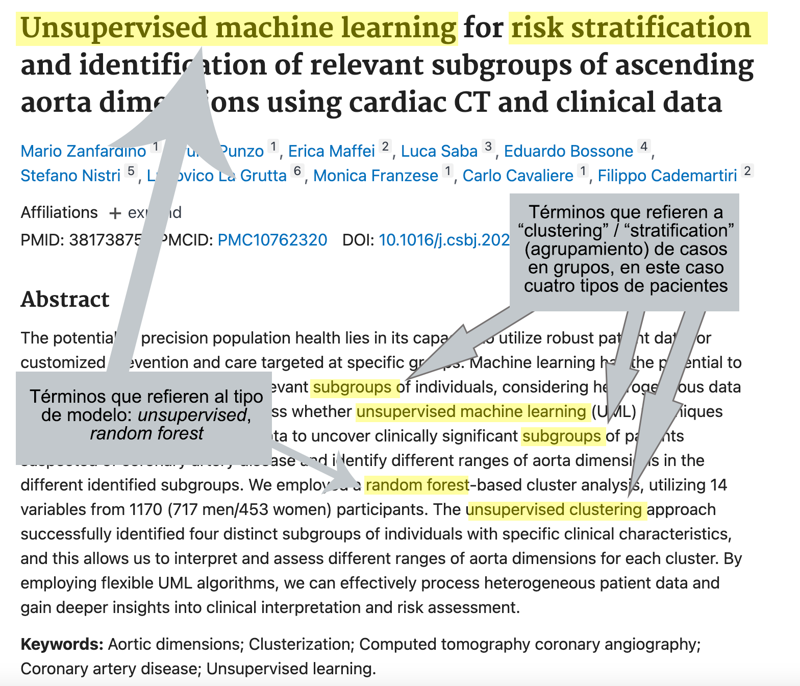
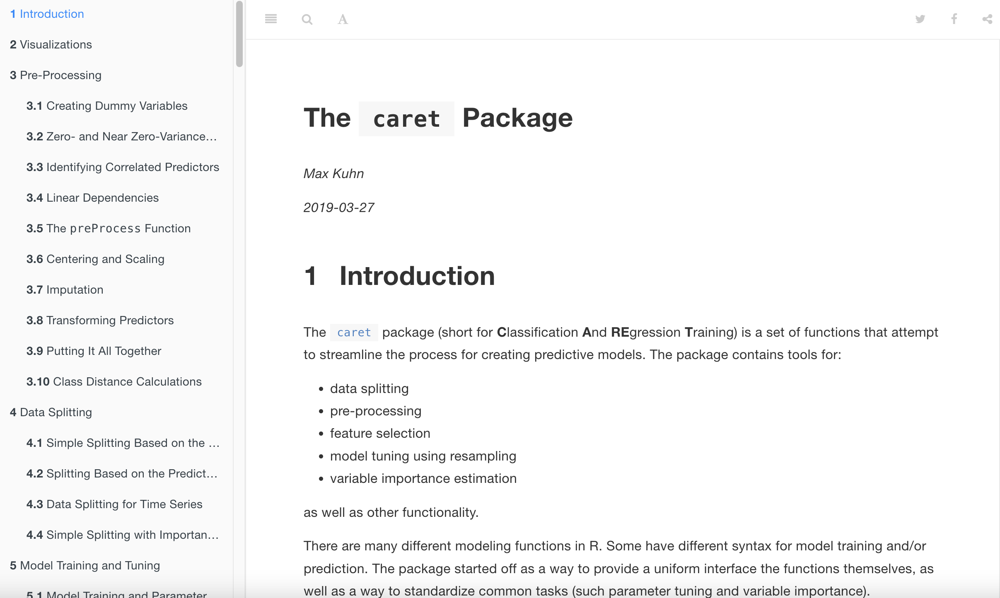
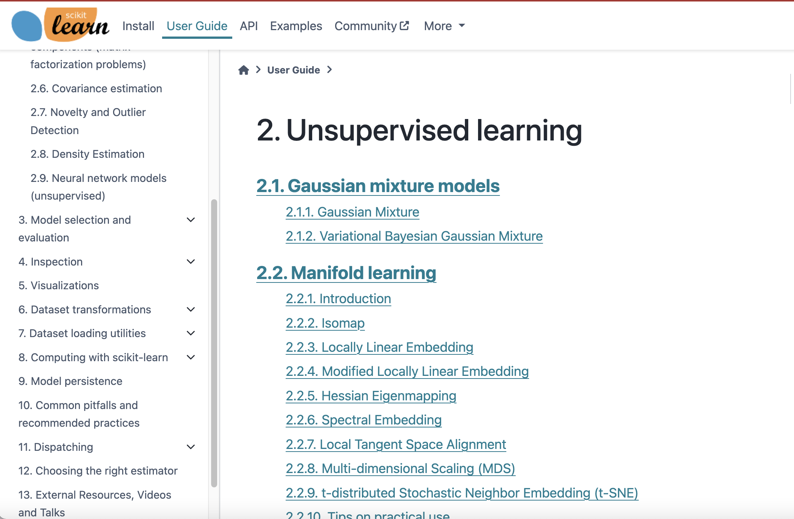
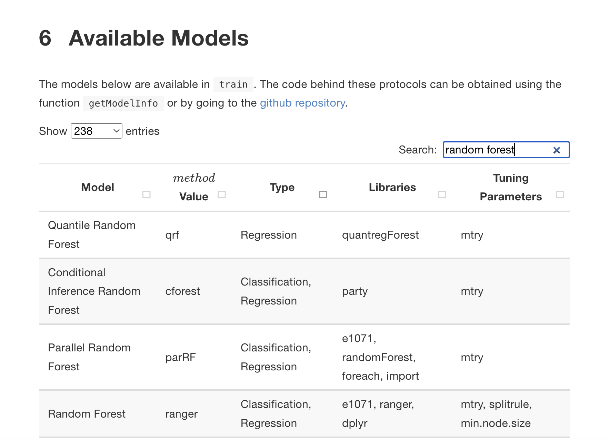
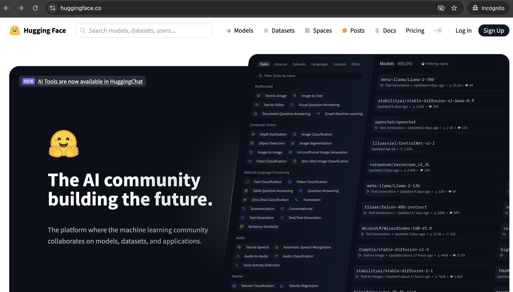

<!--

author: K. Joy Payton
email:  paytonk@chop.edu
language: es
narrator: Spanish Latin American Female
title: Taller Práctico en IA y Aprendizaje Automático

-->

# Talleres Práctico en IA y Aprendizaje Automático

Este documento ha sido escrito para acompañar dos talleres impartidos por Joy Payton en el XI Congreso "Dr. Carlos Antonio Alba Cueto", celebrado agosto 2024 en el Hospital del Niño Dr. José Renán Esquivel de Panamá.

Por favor, comparta estos materiales como considere más conveniente.

Accede a este documento:
-----

https://bit.ly/congreso_2024
<!-- style = "border: 1px solid rgb(var(--color-highlight)); max-width:50%;"-->

-------

LiaScript 
-----

El documento que está leyendo, escrito en Markdown, está alojado en GitHub, pero se visualiza de manera óptima como un curso interactivo en LiaScript.

Si está leyendo esto dentro de GitHub y prefiere verlo como un documento interactivo de LiaScript, haga clic en el siguiente enlace:

Al seleccionar el curso en LiaScript, encontrará una tabla de contenido a la izquierda y botones de control en la esquina superior derecha, los cuales le permiten ajustar el tamaño de la fuente y otras opciones de apariencia. Los controles de paginación están ubicados en la parte inferior de la página.

GitHub
----

Si, por otro lado, está leyendo esto en LiaScript pero le gustaría verlo en GitHub (por ejemplo, para hacer un fork o clonar este repositorio), por favor visite [https://github.com/pm0kjp/congreso_2024](https://github.com/pm0kjp/congreso_2024). 

Sobre la Autora 
------

Joy Payton es una científica de datos docente y supervisora de educación en datos en el Children's Hospital of Philadelphia (CHOP), donde lidera un equipo que enseña métodos computacionales reproducibles a profesionales biomédicos con el fin de avanzar en sus investigaciones.

Además de su trabajo proporcionando educación en ciencia de datos, Joy también forma parte del equipo de Informática en Salud Global en CHOP. En ese rol, aboga por enfoques de ciencia de datos que aceleren el desarrollo de un enfoque descolonizado, interdependiente y mutuamente beneficioso para la salud global. Le apasiona ayudar a los investigadores y clínicos a llevar a cabo la salud global de una manera participativa, no extractiva y no explotadora, que respete y amplifique las voces de los expertos locales, incluidos los pacientes, los miembros de la comunidad y los expertos en salud e informática.

Puede contactarla a través de su LinkedIn: [https://www.linkedin.com/in/joypayton/](https://www.linkedin.com/in/joypayton/).

## Taller 1:  ¿Cómo usar el aprendizaje automático?

### Contenido y Objetivos

En el transcurso de dos talleres, abordaremos diversos aspectos de la inteligencia artificial (IA) y el aprendizaje automático. Nuestro objetivo es dotar a los participantes de la confianza necesaria para adentrarse en un campo que puede parecer abrumador, proporcionando además pasos concretos para que las ideas fundamentales detrás del aprendizaje automático y la IA generativa se perciban como algo que han experimentado, y no solo como conceptos de los que han oído hablar.

En este primer taller, practicaremos un poco de aprendizaje automático. Aprenderemos a manejar Google Colab y a escribir código y Markdown, entrenando y probando la eficacia de varios modelos de aprendizaje automático y explicándoles.

### Notebooks / Cuadernos de Colab

¿Qué es un **cuaderno Colab** (Colab Notebook) de Google? Es un servicio alojado de Jupyter Notebook que no requiere configuración y que ofrece acceso gratuito a recursos de computación.

¿Y qué, entonces, es **Jupyter Notebook**?  Es un programa que facilita la creación de scripts de analisis de datos en las cuales cada paso que tomas es grabado cuidadosamente.  Es una forma de "[programación estadistica literaria](https://es.wikipedia.org/wiki/Programaci%C3%B3n_literaria)," donde no solo recuerdas los pasos tecnicos que hace (la programación estadistica que hace en lenguajes como **Ju**lia, **Pyt**hon, o **R** -- nota que estos tres lenguajes forman "Jupyter") sino tambien escribas en sus proprias palabras que vas a hacer y por que.

Los cuadernos provienen del mundo de los laboratorios y la practica de notar cada paso, cada ingrediente y cada accion en un experimento.  Y siguen siendo utiles para la replicabilidad hoy en dia, en el ambito de los analises de datos.

Los cuadernos de Jupyter son usados en todo el mundo, por muchos ambitos como la medicina, fisica, matematicas, negocios, y mucho mas.  De hecho, puedes buscar "cuaderno jupyter ejemplo radiologia" o "cuaderno colab ejemplo radiologia" o semejantes búsquedas, para encontrar cuadernos escritos y compartidos por otros.  Puede ser que encontraría más buscando en inglés, pero aun en castellano encontrará muchos ejemplos.

Cuando crea un cuaderno en Google Colab, no tiene que utilizar las capacidades de su propio ordenador para llevar a cabo sus analises.  Esto significa que puede aprovechar de estos cuadernos aun desde un ordenador con pocas fuerzas, como un Chromebook.  

Además, con Colab, no tiene que instalar Jupyter Notebook, ni Python -- ¡con solo tener una cuenta de Google (y ya la tiene si tiene un correo Gmail), puede usar este servicio gratuito!

Para leer más, ve a https://research.google.com/colaboratory/intl/es/faq.html.

### Ejercicio práctico: Copiar un cuaderno

**Necesitarás lo siguiente para empezar:**

Trabajaremos con este cuaderno juntos como parte del taller.

* Una computadora que te permita acceder a https://colab.research.google.com (algunas organizaciones bloquean los sitios de Google, por lo que tal vez necesites una computadora personal y no una de la empresa).  

Pasos:

* Acede a https://colab.research.google.com/drive/1TPNM_vuI_aG0l1f0cUKZH7scDVH6Lvmh?hl=es#scrollTo=g6x9ru9GivN6.
* Si ya tiene cuenta de Google (i.e. una cuenta de gmail), inicie una sesión en Google si aún no lo han hecho.  Si no tienes cuenta de Google, apuntese para poder proceder con el taller.  Esto es el "Paso 1".
* Haga una copia del cuaderno para que tenga una copia propia.  Esto es el "Paso 2".  
* Por fin, haga un doble clic en una de las celdas para ver el Markdown y como algunos símbolos como `#`, `*`, `\``, y `[texto](vinculo)` pueden cambiar la apariencia del texto.

### Ejercicio práctico: Llevar a cabo un ejercico de aprendizaje automático

Trabajaremos con este cuaderno juntos como parte del taller.

Pasos:

* Acede a https://colab.research.google.com/drive/1nOjETWZYIveJRXgl04KWcDy4LUzrDS05.
* Haga una copia del cuaderno para que tenga una copia propia.  Esto es el "Paso 2".  
* Lea las celdas de texto hasta que llegue a "Instalar Paquete de Python".  Allí encontrará la primera celda de código.
* Ejecute la celda de código: Haga click en ella y luego en el botón "Play".
* Siga así, leyendo y ejecutando las celdas.  Habrá unas celdas de código que tendrá que completar como ejercicio.

## Taller 2: Inteligencia artificial en pediatría: un guía para perplejos

En el transcurso de dos talleres, abordaremos diversos aspectos de la inteligencia artificial (IA) y el aprendizaje automático. Nuestro objetivo es dotar a los participantes de la confianza necesaria para adentrarse en un campo que puede parecer abrumador, proporcionando además pasos concretos para que las ideas fundamentales detrás del aprendizaje automático y la IA generativa se perciban como algo que han experimentado, y no solo como conceptos de los que han oído hablar.

* Iniciaremos con una breve revisión de un manuscrito recientemente publicado que examina el rol del radiólogo en el contexto del aprendizaje automático.
* Exploraremos el uso de un chatbot, sin necesidad de crear una cuenta, o, si lo preferimos, podremos crear una cuenta gratuita. Esto nos permitirá observar cómo un médico podría utilizar un modelo de lenguaje grande (LLM) y presentaremos también los riesgos asociados.
* A continuación, practicaremos la búsqueda de literatura científica relacionada con nuestros intereses, con el fin de familiarizarnos mejor con los términos de búsqueda y el vocabulario técnico en inglés, dado que este idioma predomina en la prensa científica.
* Nos familiarizaremos con catálogos de modelos pre-entrenados para identificar algunas tareas son adecuadas para el aprendizaje profundo.
*  aprenderemos a manejar Google Colab y a escribir código, entrenando y probando la eficacia de varios modelos de aprendizaje automático y explicándoles.

Al finalizar estos talleres, los participantes habrán ganado mayor confianza en:

* Comprender cómo la IA y el aprendizaje automático se integran en el ámbito de la medicina.
* Manejar la terminología y los conceptos clave relacionados con la IA y el aprendizaje automático.
* Identificar fuentes de información confiables.
* Examinar y crear notebooks (cuadernos).
* Realizar búsquedas autónomas y convertirse en autodidactas según sus propios intereses.

### IA y radiología

Un poco de tarea:

Luego, en su tiempo libre, lea un manuscrito publicado recientemente que ofrezca una descripción general útil y comprensible sobre la IA en radiología y el papel importante que desempeñan los radiólogos en hacer que esta tecnología sea útil.  

Costa, E. D., Gaêta-Araujo, H., Carneiro, J. A., Zancan, B. A. G., Baranauskas, J. A., Macedo, A. A., & Tirapelli, C. (2024). "Development of a dental digital data set for research in artificial intelligence: The importance of labeling performed by radiologists." *Oral Surgery, Oral Medicine, Oral Pathology and Oral Radiology*, 138(1), 205–213. https://doi.org/10.1016/j.oooo.2023.12.006

En este manuscrito, publicado en julio de 2024, un equipo brasileño describa la importancia de los radiologos:

> La mayoría de los modelos de IA aplicados a las imágenes médicas utilizan un conjunto de imágenes radiográficas etiquetadas para el aprendizaje supervisado, lo que implica el reconocimiento de patrones en las imágenes y el desarrollo de modelos matemáticos para realizar predicciones o tomar decisiones a partir de un nuevo conjunto de datos. 
>
> ... 
>
> La precisión de las etiquetas es esencial para el aprendizaje de la IA y su posterior uso confiable en el entorno clínico. Las etiquetas correctas en IA suelen denominarse "ground truth" y consisten en valores/aspectos confiables que pueden ser utilizados como referencia para entrenar los sistemas de IA. Los radiólogos, como profesionales que están extensamente entrenados para apreciar los principios y características de las imágenes radiográficas, así como para reconocer la anatomía y las patologías, se convierten en la referencia para generar etiquetas precisas y confiables.
>
> ... 
>
> Sin embargo, cabe señalar que la investigación propone que la IA no reemplazará al radiólogo, sino que se utilizará como una herramienta para asistir el trabajo del radiólogo.
>
> ...  
>
> La contribución de los radiólogos en la investigación con IA también ocurre en la curaduría de datos, es decir, en la selección y estandarización del formato de las imágenes, el mantenimiento y la gestión del banco de imágenes radiográficas, incluyendo la anonimización de los datos de los pacientes.

###  Modelos Grandes de Lenguaje Grande 

Los modelos grandes de lenguaje (o LLM -- "large language models" -- en inglés) son sistemas predictivos que, tras analizar grandes volúmenes de texto, son capaces de generar textos que imitan de manera realista el lenguaje humano. 

Se destacan en imitar la **forma** del lenguaje, es decir, patrones de palabras y gramática, puntuación, complejidad léxica y longitud del texto, todo **sin tener una comprensión conceptual del significado del lenguaje que generan**. Debido a su representación precisa de la forma del lenguaje humano, los LLM son útiles para generar textos de muestra que **pueden ser veraces o no**. Médicos e investigadores pueden optar por utilizar estas herramientas para acelerar tareas lingüísticas como las revisiones de literatura o la generación de resúmenes, pero deben revelar el uso de estas herramientas y tener cuidado cuando al confiar en la precisión del contenido generado por LLM.

#### Telón de Fondo: Los Riesgos

Es crucial reconocer cuales son los riesgos asociados al uso de los LLM.  

En su artículo "Ethical and social risks of harm from Language Models," Weidinger y sus coautores identifican seis dominios de riesgos, daños y costos asociados con los grandes modelos de lenguaje: 

1. Discriminación, exclusión y toxicidad
-------

¿De dónde se puede obtener enormes cantidades de texto, generado por humanos, de forma gratuita? ¡De internet! Los modelos de lenguaje y sus capacidades para predecir texto han crecido en parte debido a computadoras mejores, más rápidas y más baratas, pero también en parte debido a la proliferación masiva de texto generado por humanos que puede analizarse. Desafortunadamente, este conjunto de lenguaje está sesgado en términos de quién lo genera y las opiniones que comparten. Abundan el lenguaje tóxico, los estereotipos y los prejuicios, y estos ya han sido documentados en textos generados por LLM.

2. Peligros de la información
------

Los peligros de la información pueden causar daño al compartir información **verdadera**. Debido a que los datos de entrenamiento proporcionados a los LLM son tan vastos, hay casos en que los LLM filtran información privada, como direcciones de un domicilio privado. Además, los LLM pueden inferir y revelar correctamente información confidencial mientras acumulan y resumen datos (por ejemplo, desvelar con precisión el diagnóstico de una enfermedad grave a un usuario no preparado que le pregunta sobre sus síntomas).

3. Daños por la desinformación
--------

Los peligros de la información pueden causar daño al compartir información **falsa**.  Como dijimos anteriormente, los LLM son modelos de lenguaje. No pretenden modelar la verdad, la ciencia o el universo, sino más bien generar un lenguaje que imite de manera realista el lenguaje en el que fue entrenado. Los datos con los que se entrenan los LLM incluyen bromas, sarcasmo, desinformación, opiniones, engaños, errores que luego se corrigen y otros usos del lenguaje que no transmiten información verdadera de la manera que un usuario de LLM podría esperar.

La desinformación es particularmente perniciosa cuando el lenguaje es realista en su forma y tono, pero incluye información falsa. A principios de 2023, un abogado estadounidense utilizó ChatGPT para preparar una presentación y descubrió que el LLM había citado jurisprudencia inexistente.

El riesgo de que los LLM produzcan información falsa y realista está tan bien documentado que se le ha dado un nombre a este fenómeno: **"alucinaciones"**. Estas ocurren cuando los LLM generan texto que es objetivamente incorrecto.

4. Usos maliciosos
-----

Si bien esperamos que los investigadores biomédicos no harán un mal uso intencional de la tecnología, es importante resaltar que el lenguaje es una herramienta poderosa en manos de usuarios malintencionados. Los LLM pueden empoderar a los malos actores con un lenguaje convincente que podría usarse para ingeniería social (convencer a los humanos para que hagan clic en un enlace de un correo electrónico, por ejemplo) o campañas de desinformación. También podrían ser utilizados para recopilar información sobre disidentes políticos, facilitando el trabajo de una autoridad de vigilancia. Además, dado que los LLM pueden generar código, podrián ayudar a criminales con poca experiencia técnica escribir código malicioso.

5. Daños por la interacción persona-computadora
-------

Muchos de nosotros ya utilizamos asistentes digitales como Siri o Alexa. Estos asistentes digitales tienden a ser representados con voces femeninas, lo que, según algunos, promueve estereotipos sobre el papel de las mujeres en la sociedad como ayudantes subordinadas. Este tipo de daño podría amplificarse con el uso generalizado de LLM conversacionales. Además, debido a que el lenguaje generado por estos sistemas es tan convincente, los usuarios podrían sobrestimar la confiabilidad de los LLM, pensando en ellos como si fueran interlocutores inteligentes con la capacidad de razonar, empatizar y actuar moralmente. Esta falsa confianza podría llevar a los usuarios a compartir información privada de manera insegura con un agente conversacional "amigable".

6. Automatización, acceso y daños ambientales
-------

El entrenamiento de los LLM requiere una cantidad significativa de energía (lo que conlleva una carga de carbono asociada), así como otros recursos, como agua para la refrigeración de los centros de datos y materiales para los chips de computadora. La extracción y el uso de estos recursos pueden dañar el medio ambiente y perjudicar a las personas de manera directa e indirecta. Las personas también se ven potencialmente perjudicadas por otros aspectos de los LLM, incluidos los riesgos relacionados con el empleo, ya que los trabajos se automatizan o se vuelven menos creativos debido al uso de los LLM. Artistas y autores ya enfrentan desafíos debido al uso de sus obras como datos de entrenamiento.  Por último, existe el riesgo de ampliar la brecha digital y exacerbar las diferencias en el acceso a los beneficios de la tecnología.

#### Ejercicio práctico: Acceder a ChatGPT sin cuenta 

ChatGPT es un ejemplo de un modelo de lenguaje grande utilizado como **agente conversacional** (o **chatbot**).  La empresa propietaria, OpenAI, permite su uso (de manera limitada) de forma gratuita y sin necesidad de crear una cuenta en el sitio web https://chatgpt.com/.  

Menciono ChatGPT  aquí, no porque sea el mejor de los grandes modelos de lenguaje, sino porque su interfaz es sencilla y accesible para principiantes.

**Aviso: Es posible que los servicios para quienes no son titulares de cuentas sean lentos o estén limitados.  En tal situación, o si prefiere guardar los chats para referir a ellos más adelante, es fácil crear una cuenta gratuita usando la opcion "Subscríbete" en la esquina superior derecha.**

Para "conversar", solo hay que escribir un prompt en la caja que dice "Envía un mensaje a ChatGPT."  Sin embargo, antes de ingresar un prompt, es importante comprender que sucederá con los información trasmitida.

#### Ejercicio práctico: Entender las Políticas de OpenAI y ChatGPT

Lea la política de privacidad, en [https://openai.com/es-US/policies/privacy-policy/](https://openai.com/es-US/policies/privacy-policy/).

Debido a que muchos chatbot (incluido ChatGPT) almacenan los **prompts** (los mensajes que ingresa el usuario) y los datos de los usuarios y las utilizan para refinar aún más sus modelos, es posible que la información que envíe en un chat pueda crear un peligro de información futuro a través de un incidente de filtración de información. Por este motivo, **nunca debe proporcionar información privada en un mensaje de chat**, incluida información de identificación personal, información sobre pacientes o participantes en investigaciones, secretos comerciales, etc.

**Si desea utilizar un LLM como herramienta en el ámbito de la investigación o la medicina, debe utilizar un LLM local (como Llama, BERT, y otros que se distribuyen de forma gratuita y pueden ser implementado dentro del sistema informático de su organización).**

También es recomendable leer los Términos y Condiciones en [https://openai.com/es-US/policies/terms-of-use/](https://openai.com/es-US/policies/terms-of-use/).  En éste documento, se lee, entre otras cosas, lo siguiente:

> * El Output puede no ser siempre exacto. No considere que el Output de nuestros Servicios es la única fuente de información veraz o fáctica, ni un sustituto del asesoramiento profesional. 
> * Debe evaluar la exactitud e idoneidad del Output en relación con su caso de uso concreto, incluyendo mediante la realización de una revisión por medios humanos, en su caso, antes de utilizar o compartir el Output de los Servicios.
> * No debe utilizar el Output relativo a una persona para ningún fin que pueda tener un impacto significativo o consecuencias legales para dicha persona, por ejemplo, para tomar decisiones sobre cuestiones financieras, educativas o laborales, decisiones en materia de vivienda y seguros, sobre cuestiones legales o médicas u otras decisiones importantes relacionadas con dicha persona. 
> * Nuestros Servicios pueden generar Output incompleto, incorrecto u ofensivo que no represente las opiniones de OpenAI. Si el Output hace referencia a productos o servicios de terceros, esto no significa que el tercero respalde o esté afiliado a OpenAI.

#### Prompt 1: Estructurar Texto 

Utilice LLM para crear un esquema para un manuscrito, presentación de diapositivas, CV u otro género literario altamente estructurado.  

Este es un ejemplo de cómo se pueden utilizar las capacidades de un LLM para imitar la **forma del lenguaje** sin depender indebidamente de su capacidad para generar contenido científico fáctico.

**Prompt:** "Haz un esquema para un manuscrito revisado por pares que describa un ensayo clínico".

**Preguntas:**

* ¿Está de acuerdo con la respuesta proporcionada por el LLM?
* ¿Qué tan semejante es la respuesta que recibió en comparación con la respuesta que otros usuarios han recibido?

Si lo desea, pruebe con otros prompts que le puedan ayudar a planificar y estructurar sus escritos.

#### Prompt 2: Resumir Textos

Utilice los LLM para resumir textos o abordar temas clave.

Prompt: "Resuma los puntos principales de 'Energy and Policy Considerations for Deep Learning in NLP' de Strubell".
**Prompt:** "Resuma los puntos principales de 'Energy and Policy Considerations for Deep Learning in NLP' de Strubell".

Es importante tener precaución al utilizar LLM para resumir textos, ya que estos modelos pueden "alucinar", es decir, generar información incorrecta o inventada. Trate estos resúmenes como si provinieran de un miembro junior de su equipo: ¡es crucial revisar su trabajo antes de confiar plenamente en él!

**Preguntas:**

* ¿Cómo podría asegurarse de que el resumen es correcto?
* ¿Cuáles son algunos riesgos de confiar en este resumen sin verificar su precisión?

#### Prompt 3: Borrador de Texto

Este caso de uso debe manejarse con precaución, evitando la transmisión de datos reales. Con la divulgación adecuada y la verificación de la precisión, los investigadores biomédicos podrían utilizar los LLM para generar borradores iniciales de ciertos textos.

**Prompt:** "Escriba una breve carta de recomendación para mi asistente de investigación Fulana de Tal, quien hizo un excelente trabajo con sujetos humanos en la investigación del autismo".

**Preguntas:**

* ¿En qué circunstancias tengo la responsabilidad de divulgar que he utilizado un LLM para redactar un texto?
* ¿Tiene este texto la "voz" de un robot?  Algunos dicen que los LLM tienen un tono o estilo reconocible.  

#### Prompt 4: Trabajar con Código

Subrayamos de nuevo: ésta es un área en la que los usuarios deben tener especial cuidado. Evite divulgar de manera inadvertida datos sensibles, descripciones estadísticas de sus datos, esquemas de bases de datos u otra información potencialmente confidencial.

**Prompt:** "Usando el código R de tidyverse, escriba un código que tomará una columna de marco de datos llamada 'id' y la dividirá en dos columnas llamadas 'id\_paciente' y 'numero\_muestra'. Los datos en la columna 'id' tienen estos dos valores separados por un guión bajo."

**Preguntas:**

* ¿Cuáles son las ventajas de poner el poder de escribir código en manos de más personas?
* ¿Cuáles son los riesgos o peligros?

#### Prompt 5: Traducir Textos

Considere las políticas de su institución respecto a la traducción y determine si la regulación aplicable permite el uso de herramientas de traducción basadas en IA. Las traducciones generadas por IA deben tratarse como borradores que **siempre** deben ser revisados y validados por profesionales.

**Prompt:** Traduzca la frase "Se le compensará por su tiempo con una tarjeta de regalo por valor de $10 cada vez que se presente en su visita programada al laboratorio y complete un EEG" al inglés.

#### Nota importante

Tenga en cuenta que todo lo que se genere utilizando un LLM no tiene garantía de precisión, por lo que es su responsabilidad validar la exactitud de los resultados proporcionados por la IA.

Además, tenga en cuenta que algunas publicaciones prohíben expresamente el uso de LLM para contribuir con lenguaje a manuscritos o tienen políticas sobre la divulgación del uso de IA en cuanto al manuscrito, código, o imagenes. No cumplir con estas restricciones puede tener consecuencias profesionales serias y desagradables.

### IA y Aprendizaje Automático en Medicina: Manuscritos

El número de manuscritos en el ámbito de medicina que mencionan IA o aprendezaje automatico sigue aumentando cada año.  [PubMed](https://pubmed.ncbi.nlm.nih.gov/), el catálogo de la [Biblioteca Nacional de Medicina (NLM) de los Estados Unidos](https://www.usa.gov/es/agencias/biblioteca-nacional-de-medicina) y el catálogo más grande de medicina en el mundo, enumera más que 45.000 articulos publicados en 2023 con el termino "artificial intelligence" o "machine learning", [con más que 200.000 resultados en total](https://pubmed.ncbi.nlm.nih.gov/?term=%28%22artificial+intelligence%22%29+OR+%28%22machine+learning%22%29&sort=pubdate).  

<!-- style = "border: 1px solid rgb(var(--color-highlight));"-->

Si añadimos "radiology" como término de búsqueda, hay casi 15.000 artículos en total, con más de 3.000 publicados en 2023.

Algunos de los temas abordados en [los artículos que mencionan radiología y uno de los términos IA o aprendizaje automático publicados en 2023](https://pubmed.ncbi.nlm.nih.gov/?term=%28%28%28Artificial+Intelligence%29+OR+%28Machine+Learning%29%29+AND+%28radiology%29%29+AND+%28%28%222023%2F01%2F01%22%5BDate+-+Publication%5D+%3A+%222023%2F12%2F31%22%5BDate+-+Publication%5D%29%29&sort=pubdate) incluyen:

* [Dimensiones de la aorta ascendente](https://pubmed.ncbi.nlm.nih.gov/38173875/)
* [Infecciones fúngicas invasivas](https://pubmed.ncbi.nlm.nih.gov/38144574/)
* [Colangiocarcinoma perihiliar](https://pubmed.ncbi.nlm.nih.gov/38075015/)
* [Enfermedad de los pequeños vasos cerebrales](https://pubmed.ncbi.nlm.nih.gov/38149750/)
* [Cáncer de próstata](https://pubmed.ncbi.nlm.nih.gov/38153859/)
* [Cáncer de mama](https://pubmed.ncbi.nlm.nih.gov/38115810/)
* [Meningioma](https://pubmed.ncbi.nlm.nih.gov/38112331/)
* [Glioblastoma](https://pubmed.ncbi.nlm.nih.gov/37955154/)
* [Reducción del contraste con gadolinio](https://pubmed.ncbi.nlm.nih.gov/37905681/)
* [Injerto óseo del seno maxilar](https://pubmed.ncbi.nlm.nih.gov/38033189/)
* [Endometriosis](https://pubmed.ncbi.nlm.nih.gov/38017285/)
* [Odontología de implantes](https://pubmed.ncbi.nlm.nih.gov/37990981/)
* [Segmentación del septo interventricular en talasemia](https://pubmed.ncbi.nlm.nih.gov/37941460/)
* [Glioma del tronco encefálico](https://pubmed.ncbi.nlm.nih.gov/37905976/)
* [Tumor fibroso solitario intracraneal](https://pubmed.ncbi.nlm.nih.gov/37897302/)
* [RM cardíaca](https://pubmed.ncbi.nlm.nih.gov/37855257/)
* [Carcinoma papilar de tiroides](https://pubmed.ncbi.nlm.nih.gov/37783270/)

#### Ejercicio práctico: PubMed y IA 

Haga una busqueda de términos utilizando un término que sea de su interés en PubMed (solo disponible en inglés), con la forma `(("artificial intelligence") OR ("machine learning")) AND ("término de interés")`

Comience haciendo clic en [este ejemplo preparado previamente](https://pubmed.ncbi.nlm.nih.gov/?term=%28%28%22artificial+intelligence%22%29+OR+%28%22machine+learning%22%29%29+AND+%28%22MRI%22%29&sort=pubdate) de `(("artificial intelligence") OR ("machine learning")) AND ("MRI")`, y luego sustituya "MRI" por el término de su interés.

Muchos de estos artículos están disponibles solo mediante pago. Si un manuscrito es disponible de modo gratuito, la página de aquel manuscrito tendrá un botón como el siguiente:

<!-- style = "border: 1px solid rgb(var(--color-highlight));"-->

Si encuentra dificultades para acceder a estos recursos, una estrategia eficaz es buscar la dirección de correo electrónico de uno de los autores, expresar su interés en leer el artículo, y solicitar si pueden enviarle un archivo .pdf.

Para el siguiente ejercico, identifica desde la búsqueda de PubMed algunos manuscritos que:

1) Le interesan por su contenido o tema 

2) Tienen uno de:

-  "Free Full Text" (texto completo gratuito) o 
-  Un resumen / abstract muy completo que describe algo sobre el uso de IA o aprendizaje automático.  

En el siguiente ejercicio, buscará términos en estos manuscritos que tienen que ver con IA y aprendizaje automático.  Términos que suelen aparecer incluyen: "machine learning," "deep learning", "neural network", "artificial intelligence", "AI".

#### Ejercicio práctico: Identificar términos

Un artículo (o incluso a veces solo el resumen) que describa una investigación basada en la IA o el aprendizaje automático  probablemente incluirá información sobre la tarea que realiza el modelo, los datos empleados, detalles sobre el propio modelo, entre otros aspectos.

Muchas veces, los manuscritos describen tareas de aprendizaje automático en las que los autores entrenaron nuevos modelos en pequeños conjuntos de datos privados que pertenecen a un hospital o laboratorio. Pueden describir las bibliotecas que utilizaron para realizar este trabajo, como `caret` de R o `sklearn` de Python. Ocasionalmente, se verá a los autores usando modelos grandes y preentrenados, en particular para trabajos con lenguaje o imágenes. En este caso, usarán un modelo que fue entrenado en una amplia variedad de datos, y podrían usarlo tal como es o hacer un 'ajuste fino' del modelo de propósito general para que funcione mejor en sus datos especificos.

Intente identificar en los artículos que eligió: la tarea realizada, el tipo de modelo utilizado y cualquier otro detalle relevante que pueda percibir.

A continuación, hemos incluido algunos términos en inglés y español para facilitar este ejercicio.

* **La tarea de IA o aprendizaje automático:** classification/clasificación, regression/regresión, clustering/agrupamiento, language generation/generación de lenguaje, image generation/generación de imágenes, computer vision/visión por computadora, natural language processing/procesamiento del lenguaje natural, etc.
* **El tipo específico de modelo:** support vector machine/máquina de soporte vectorial, random forest/bosque aleatorio, large language model/modelo de lenguaje grande, logistic regression/regresión logística, hierarchical clustering/agrupamiento jerárquico, etc.
* **Métricas das para evaluar la eficacia del modelo:** Accuracy/exactitud, precision/precisión, recall o sensitivity/sensibilidad, specificity / especificidad, area under the curve (AUC) /  área bajo la curva, F1, balanced accuracy/precisión balanceada, etc.  Para entender más sobre estas métricas, lea [un articulo que los describe](https://profesordata.com/2020/08/07/evaluando-los-modelos-de-clasificacion-en-aprendizaje-automatico-la-matriz-de-confusion-claramente-explicada/.)

**Preguntas:**

* ¿Qúe tarea realiza el modelo?  ¿Sobre qúe tipo de datos?
* ¿Ha identificado algunos términos sobre el tipo de modelo?

### Algoritmos de Aprendizaje Automático

Esta mañana, entrenabamos un modelo sobre datos que tratan del cancer de mama, y utilizando la biblioteca de Python llamada `sklearn`.  Este conjunto de herramientas es muy util y ofrece muchos algoritmos de aprendizaje. 

<!-- style = "border: 1px solid rgb(var(--color-highlight));"-->

La mayoría del aprendizaje automático se lleva a cabo usando el lenguaje Python.  Sin embargo, si ya sabe R y prefiere trabajar en este lenguaje, es posible hace aprendizaje automático usando el paquete `caret`.

<!-- style = "border: 1px solid rgb(var(--color-highlight));"-->

#### Ejercicio práctico: Buscar algoritmos de interés

sklearn
----

Aceda a https://scikit-learn.org/stable/auto_examples/index.html para ver algunos ejemplos de como se usa `sklearn`.  

Luego, en la caja de búsqueda, busque algunos de los términos que encontró en los artículos de PubMed.  

Por ejemplo, tras leer algo sobre "unsupervised learning" en el resumen de un manuscrito en PubMed, uno podría encontrar información entre los documentación de sklearn:

<!-- style = "border: 1px solid rgb(var(--color-highlight));"-->

caret (optativa, si prefiere R más que Python)
-----

Utilice la búsqueda en [https://topepo.github.io/caret/available-models.html](https://topepo.github.io/caret/available-models.html) para ver aprender más sobre los tipos de modelos que se puede crear en `caret`.

Por ejemplo, hay varios metodos para crear un modelo que usa un algoritmo de "random forest":

<!-- style = "border: 1px solid rgb(var(--color-highlight));"-->

### Catalogos de Modelos Previamente Entrenados

Para tener una idea de la amplitud de tareas que la inteligencia artificial puede realizar, resulta útil explorar un catálogo de modelos previamente entrenados. [Hugging Face](https://huggingface.co/) ofrece un catálogo de código abierto y basado en la comunidad, que incluye modelos de aprendizaje profundo (deep learning), conjuntos de datos y código compartido por científicos de datos e investigadores de diversas industrias. Hasta donde he podido verificar, Hugging Face no cuenta con un sitio web en español, pero su plataforma es muy completa, si no le importa navegar en inglés.  Su lema es "democratizar la inteligencia artificial."

<!-- style = "border: 1px solid rgb(var(--color-highlight));"-->

Puede leer más sobre Hugging Face en español a través de un [artículo sobre el uso de sus Transformers](https://learn.microsoft.com/es-es/azure/databricks/machine-learning/train-model/huggingface/), o en [un sencillo guia a su interfaz](https://keepcoding.io/blog/que-es-hugging-face/).

Otros catálogos pertenecientes a entidades con fines de lucro son más propensos a tener soporte en varios idiomas. Por ejemplo, el Model Garden de Google Cloud Platform (https://console.cloud.google.com/vertex-ai/model-garden?hl=es) puede darte una idea del tipo de tareas que los modelos de IA pueden realizar en esa plataforma.  Sin embargo, estos suelen describir los modelos solo en inglés.  Por este motivo, resulta útil mantener a mano un glosario de términos, como [el de inteligienciaartificial.blog](https://inteligenciaartificial.blog/glosario-de-ia/) o [el de TN University](https://www.tnuniversity.edu.mx/docs/newsletter/Portadas/Diccionario%20sobre%20Inteligencia%20Artificial.pdf).

#### Ejercicio práctico: Explorar un catálogo de modelos

Si no le molesta trabajar en inglés el catálogo de, [Hugging Face](https://huggingface.co/models) es el mejor lugar para comenzar, pero también puede explorar otros catálogos, como el [Model Garden de Google Cloud Platform](https://console.cloud.google.com/vertex-ai/model-garden?hl=es).

Si ha identificado algunos tipos de modelos o tareas de mayor interés en las búsquedas realizadas en PubMed, le sugiero explorarlos en el catálogo. En caso de no tener un modelo específico en mente, una recomendación sería buscar modelos que realicen "segmentación de imágenes" o "image segmentation".

Trate de responder las siguientes preguntas:

* ¿Existen modelos disponibles que realicen la tarea que le interesa?
* ¿Puede encontrar "notebooks" o código de ejemplo que muestren cómo utilizar uno de estos modelos?
* ¿Puede encontrar una "model card" (ficha o "tarjeta" que describa el modelo) que incluya detalles importantes sobre el modelo, como el tipo de licencia, quién lo creó, una descripción, etc.?
